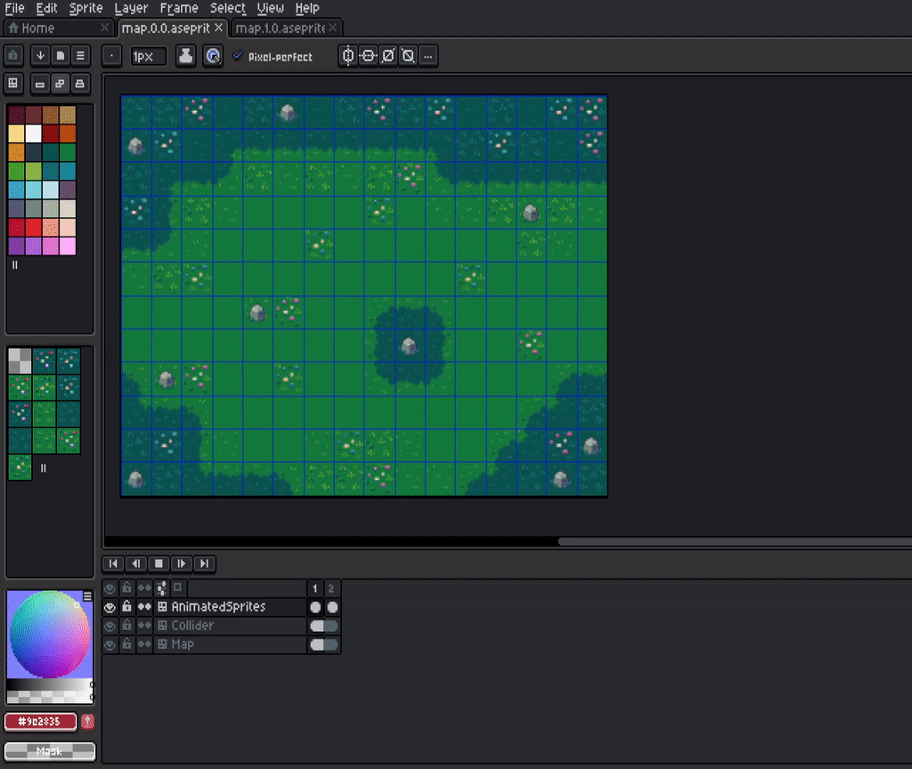
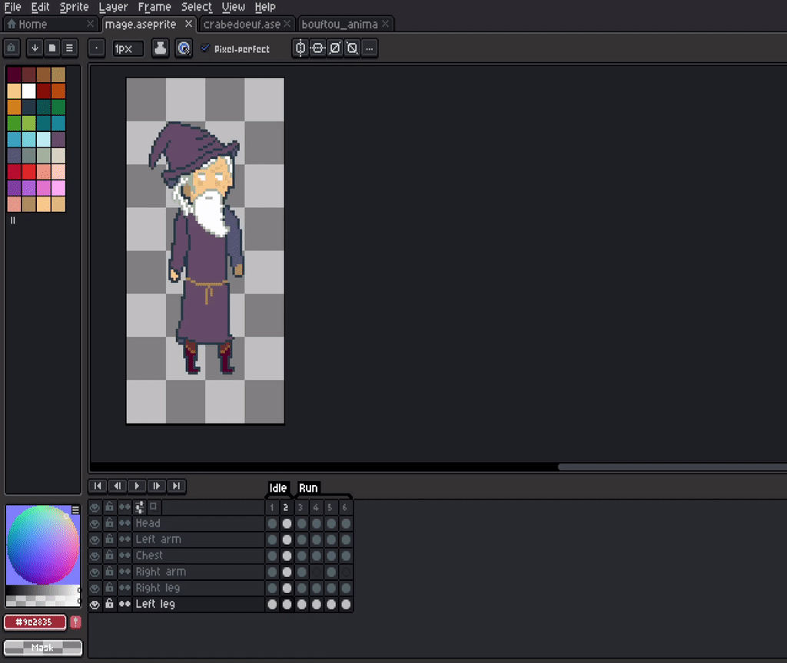
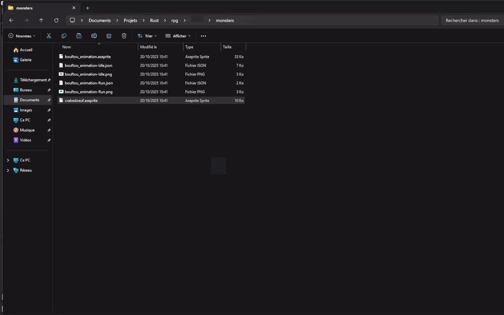

# RPG Assets

## Overview

I have write a little assets engine for the game:

- Load `json` exported assets metadata
- Load `png` tilesets associated to each `json`
- Generate collider map for maps
- Then the game engine is able to play the sprites with their respective frames and duration, to reproduce animation from Aseprite.

##### `assets` folders:

- characters
- monsters
- maps
- interface
- font

##### `tests` folder:

Store some draft or drawing tentatives.

##### `export-aseprite-file` :

Github submodule, forked from [David Capello repo](https://github.com/dacap/export-aseprite-file).
It hold some lua script used to export maps for the game engine.

##### `aseprite_convert_map.bat` :

This is a windows script to quickly export all maps in the right folder.
This script lacks love since i have just write the minimum required to make it works.
You should update the path inside to make it works on your computer.
(Mainly `ASEPRITE` variable)

There is no shell equivalent for Linux for now.
Because i use Aseprite mainly on my windows computer.

## Maps

In Aseprite maps used tilemap and tilesets.
Usually to draw a new tile, i create a new aseprite temporary file with a 64 x 64 pixel size and i start to draw.
When my new tile is ready i simply copy / paste it within the map file.
Then Aseprite automatically add it to the tileset and then i can start using it.

#### Layer rule

The map importer in the game expect that the map respect some rules.
Maps are composed of three layers:

- AnimatedSprites
- Collider
- Map

This three layer are used by the asset engine to handle animation and colliders.
Any map should respect these three layer rule.

###### AnimatedSprites

In this layer you should draw all the animated tiles for the map.
The game will only use this layer to play animations.
It also read each frame duration, so any value setted in Aseprite duration frames properties will be used in the game.

###### Collider

All collider sprites should be drawn here.
The game observe this layer, and compute a binary table for each cells:
0 the cell is free, 1 the cell is a collider.
If you draw something that entities can't walk on, you have to place this sprite here.

###### Map

Static sprite leaves here, basically sprites that are not animated and not collider.

Any exported map that doesn't respect thoose rules will result as unexpected behaviour
if loaded by the game asset engine.



#### Export

##### Prerequisite

`aseprite_convert_map.bat` use [export aseprite file from David Capello](https://github.com/dacap/export-aseprite-file)
Therefore i have fork this repository and add it as submodule in the project.
If your `assets/export-aseprite-file` folder is empty you can run:

```sh
cd assets
git submodule update --checkout -f export-aseprite-file
```

All files needed by `aseprite_convert_map.bat` should be there now.

Finally you can export the maps, by running `aseprite_convert_map.bat` script on windows.

Each new map, will require to edit this script to add command lines with the new map file.

## Entities

The entities importer also have a rule to respect.

#### Tag rule

- Each Animations should be tagged.
- Tag name will be used in exported files names.
- Tag name will be used in animation names in the engine.
- For now the engine handle only two animations:
  - Idle
  - Run



#### Export

##### Prerequisite

- Download `Tags-To-Sheets.lua` from [AdamYounis](https://github.com/adamyounis/Aseprite-Tools/tree/main)
- Open Aseprite and click on: `File > Scipts > Open Scripts Folder`
- Copy the `Tags-To-Sheets` script in the open folder.
- You can make Aseprite detect your script without restart:
  `File > Scipts > Rescan Scripts Folder`

You are ready.

When you are ready and your tags are correctly sets.

You just have to click on: `File > Scripts > Tags-To-Sheets`
Aseprite will create `.json` and `.png` files for each tagged animation.

Files are saved at the same place of your `.aseprite` file.


